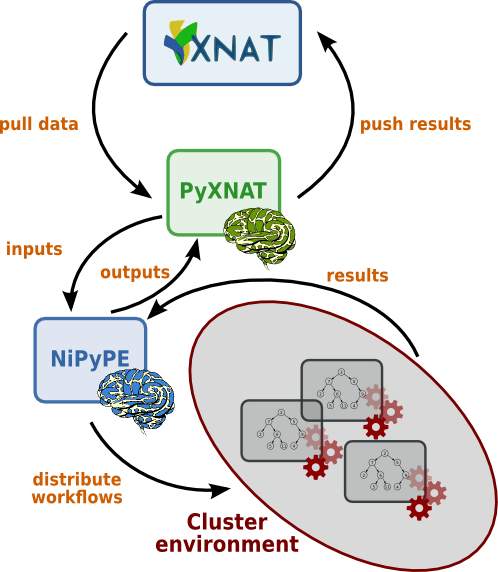

External Resources
==================

Documentation
-------------

The ICTS at the University of Iowa has published its own documentation
for PyXNAT. 

A very good User Guide can be found here: 
https://www.icts.uiowa.edu/confluence/display/ICTSit/pyxnat+Usage

A very detailed Installation Guide can be found here:
https://www.icts.uiowa.edu/confluence/display/ICTSit/pyxnat+Installation+Instructions

NiPyPE
------

`NiPyPE <http://nipy.sourceforge.net/nipype/>`_ is a Python library that 
interfaces to existing neuroimaging software such as SPM, FSL and 
Freesurfer. It also features a workflow engine that enables it to 
distribute jobs over multiple machines or clusters. It is able to pull
data from XNAT and push back the results using PyXNAT.

